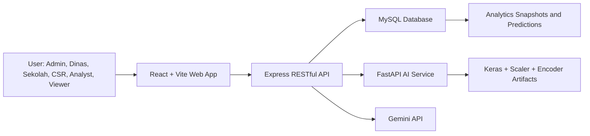

# PINTARIN

**Education Aid Intelligence Platform**

PINTARIN adalah aplikasi full stack untuk membantu distribusi bantuan pendidikan agar lebih tepat sasaran, transparan, dan mudah divalidasi. Sistem ini menggabungkan dashboard role-based, peta risiko wilayah, AI risk scoring, CSR matching, pengajuan bantuan sekolah, validasi dinas, human-in-the-loop review, dan asisten Gen AI berbasis Gemini.

Project ini dibuat sebagai capstone **CC26-PSU211** dengan konteks utama distribusi bantuan pendidikan di Kota Bandung. PINTARIN tidak menjadikan AI sebagai pengambil keputusan final. AI berfungsi sebagai decision support, sedangkan keputusan akhir tetap berada pada manusia melalui role Admin dan Dinas.

## Daftar Isi

- [Ringkasan Produk](#ringkasan-produk)
- [Informasi Capstone dan Tim](#informasi-capstone-dan-tim)
- [Learning Path dan Kontribusi](#learning-path-dan-kontribusi)
- [Masalah yang Diselesaikan](#masalah-yang-diselesaikan)
- [Solusi PINTARIN](#solusi-pintarin)
- [Kesesuaian dengan Project Plan](#kesesuaian-dengan-project-plan)
- [Dokumentasi Pengerjaan](#dokumentasi-pengerjaan)
- [Arsitektur Sistem](#arsitektur-sistem)
- [Stack Teknologi](#stack-teknologi)
- [Struktur Project](#struktur-project)
- [Role dan Hak Akses](#role-dan-hak-akses)
- [Fitur Utama](#fitur-utama)
- [User Flow](#user-flow)
- [Frontend Routes](#frontend-routes)
- [RESTful API](#restful-api)
- [Database](#database)
- [AI dan Data Flow](#ai-dan-data-flow)
- [Environment Variables](#environment-variables)
- [Setup Lokal](#setup-lokal)
- [Akun Demo](#akun-demo)
- [Testing dan Quality Gate](#testing-dan-quality-gate)
- [Security](#security)
- [Scalability dan Maintainability](#scalability-dan-maintainability)
- [Deploy](#deploy)
- [Checklist Capstone](#checklist-capstone)
- [Troubleshooting](#troubleshooting)
- [Catatan Audit Terakhir](#catatan-audit-terakhir)

## Ringkasan Produk

PINTARIN membantu stakeholder pendidikan membaca prioritas bantuan dengan lebih cepat. Data sekolah, wilayah, indikator pendidikan, proposal CSR, pengajuan kebutuhan sekolah, dan prediksi AI ditampilkan dalam dashboard yang disesuaikan dengan role pengguna.

Target pengguna utama:

- **Dinas Pendidikan**: membaca risiko wilayah, memvalidasi bantuan CSR/sekolah, dan melakukan review prediksi AI.
- **Sekolah**: mengajukan kebutuhan bantuan dan memantau status pengajuan.
- **Mitra CSR**: mencari wilayah atau sekolah yang relevan untuk program bantuan.
- **Admin**: mengelola data, workspace role, validasi, dan konsistensi sistem.
- **Analyst**: membaca tren data, confidence score, dan kualitas prediksi.
- **Viewer**: melihat ringkasan informasi tanpa aksi operasional.

Prinsip produk:

- Bantuan diarahkan ke prioritas yang lebih jelas.
- AI memberi rekomendasi, bukan keputusan final.
- Setiap aksi penting memiliki validasi dan jejak audit.
- UI dibuat bersih, responsif, dan mudah dibaca pada berbagai ukuran layar.

## Informasi Capstone dan Tim

| Informasi | Nilai |
| --- | --- |
| Nama project | PINTARIN |
| Tema | Education aid intelligence, risk scoring, CSR matching |
| Capstone ID | CC26-PSU211 |
| Area studi | Kota Bandung |
| Tipe aplikasi | Full stack web application |
| Frontend | React SPA |
| Backend | Express RESTful API |
| AI service | FastAPI inference service |
| Database | MySQL |
| Status deploy | Siap deploy demo setelah environment production, database, dan artifact AI disiapkan |

### Anggota Tim

| Nama | ID | Learning Path | Role Project | Fokus Kontribusi |
| --- | --- | --- | --- | --- |
| Muhammad Aqmal Madani | CFCC630D6Y2829 | Front-End and Back-End | Full Stack Web Developer | Frontend dashboard, integrasi API, UI/UX, backend workflow |
| Taukhid Aji Nurwijayadi | CFCC155D6Y2830 | Front-End and Back-End | Full Stack Web Developer | Backend API, database workflow, role access, integrasi sistem |
| Richo Alifian Nokie | CACC012D6Y1361 | Artificial Intelligence | AI Engineer | Model AI, inference service, risk scoring |
| Gading Rizky Maulana | CACC012D6Y2582 | Artificial Intelligence | AI Engineer | Model AI, preprocessing, evaluasi model |
| Jonathan Delen Hosea | CDCC002D6Y0817 | Data Science | Data Scientist | Dataset, eksplorasi data, indikator risiko |
| Ladiva Azzahra Puteri Darmawan | CDCC012D6X1251 | Data Science | Data Scientist | Data preparation, analisis wilayah, insight data |

## Learning Path dan Kontribusi

PINTARIN dirancang agar setiap learning path capstone punya kontribusi yang terlihat di aplikasi.

### Front-End and Back-End

Implementasi utama berada di:

- `apps/web`: React, Vite, Tailwind CSS, routing, dashboard, form, visualisasi, responsive UI.
- `apps/api`: Express RESTful API, JWT auth, RBAC, service layer, repository MySQL, validation, rate limiter.

Output learning path ini:

- Landing page dan dashboard role-based.
- API modular untuk analytics, regions, predictions, school requests, CSR aid, Gen AI, dan admin database.
- Proteksi route berbasis role.
- Integrasi frontend ke backend menggunakan Axios service layer.
- Build system menggunakan Vite dan npm workspace.

### Artificial Intelligence

Implementasi utama berada di:

- `apps/ai`: FastAPI inference service.
- `apps/ai/services/model_service.py`: service pemuatan model dan prediksi.
- `apps/ai/models`: metadata dan artifact model AI.
- `apps/api/src/modules/ai`: bridge dari Express ke FastAPI.
- `apps/api/src/modules/predictions`: penyimpanan dan review hasil prediksi.

Output learning path ini:

- Risk scoring wilayah.
- Risk label dan confidence score.
- Batch prediction.
- Human review flag untuk prediksi yang perlu validasi manusia.
- Hybrid recommendation support untuk konteks bantuan.

### Data Science

Implementasi utama berada di:

- `data/raw`: dataset awal.
- `apps/api/src/db/seeds/data`: CSV yang dipakai importer runtime.
- `apps/api/src/db/seeds/importEducationIndicators.js`: importer data indikator pendidikan.
- `analytics_snapshots`, `education_indicators`, dan `predictions`: tabel runtime analitik.

Output learning path ini:

- Dataset indikator pendidikan.
- Agregasi data per wilayah dan tahun.
- Ranking prioritas wilayah.
- Insight peta risiko.
- Data foundation untuk AI dan dashboard.

## Masalah yang Diselesaikan

Distribusi bantuan pendidikan sering menghadapi beberapa kendala:

- Data kebutuhan sekolah dan data bantuan tersebar di banyak sumber.
- Wilayah prioritas sulit dibandingkan secara cepat.
- Bantuan CSR dapat tidak selaras dengan kebutuhan paling mendesak.
- Keputusan berbasis data tetap membutuhkan validasi manusia.
- Riwayat bantuan perlu transparan dan tidak boleh tercampur antar sekolah.

PINTARIN menyelesaikan masalah tersebut dengan menyatukan data, prediksi AI, validasi manusia, dan workflow bantuan dalam satu aplikasi.

## Solusi PINTARIN

PINTARIN menyediakan:

- **Map Risk** untuk membaca prioritas wilayah Kota Bandung.
- **AI Risk Scoring** untuk membantu menilai tingkat risiko pendidikan.
- **CSR Matching** untuk membantu mitra CSR menemukan target bantuan yang relevan.
- **Validasi Dinas** untuk meninjau pengajuan sekolah dan CSR.
- **Human Review** untuk memvalidasi prediksi AI yang confidence-nya rendah.
- **Riwayat Pengajuan** untuk sekolah dan CSR.
- **Manage Database** untuk admin dengan whitelist tabel dan field.
- **Gen AI Assistant** untuk membantu membaca konteks dashboard sesuai role.

## Kesesuaian dengan Project Plan

Project plan CC26-PSU211 menargetkan sistem AI untuk mengidentifikasi risiko pendidikan di Kota Bandung, mengintegrasikan hasil model ke aplikasi web, dan tetap menyediakan validasi manusia. Implementasi saat ini sudah menutup kebutuhan inti tersebut.

| Poin Project Plan | Implementasi di PINTARIN | Status |
| --- | --- | --- |
| Identifikasi wilayah/kelompok risiko pendidikan tertinggi | Map Risk, dashboard analyst/viewer, tabel `regions`, `education_indicators`, dan `predictions` | Terimplementasi |
| Faktor risiko seperti ekonomi, sekolah, dan bantuan | Dataset indikator pendidikan, agregasi wilayah, risk score, vulnerability index, dan coverage PIP | Terimplementasi |
| Model machine learning untuk skor prioritas bantuan | FastAPI AI service, model Keras, scaler/encoder artifact, batch prediction, dan penyimpanan ke tabel `predictions` | Terimplementasi |
| Integrasi hasil AI ke aplikasi web | Express AI bridge, endpoint `/api/ai`, `/api/predictions`, dashboard confidence score, dan review queue | Terimplementasi |
| Stakeholder sekolah, dinas, CSR, dan admin | Dashboard role-based, RBAC backend, pengajuan sekolah, proposal CSR, dan manage database | Terimplementasi |
| Rule-based dan human-in-the-loop validation | Role Admin/Dinas dapat approve, override, atau flag prediksi AI melalui `prediction_validations` | Terimplementasi |

Catatan batasan: PINTARIN sudah layak untuk demo capstone dan deploy demo setelah environment production disiapkan. Untuk production publik berskala besar, sistem masih perlu observability, backup database otomatis, Redis-backed rate limiter, load test, dan strategi distribusi artifact AI yang jelas.

## Dokumentasi Pengerjaan

Dokumentasi pendukung berada di folder `docs` dan file referensi capstone:

| Dokumen | Fungsi |
| --- | --- |
| `README.MD` | Dokumentasi produk utama, setup, API, database, testing, security, dan deploy |
| `docs/CAPSTONE_CHECKLIST_EVIDENCE.md` | Bukti pemenuhan checklist capstone |
| `docs/DEPLOYMENT_READINESS.md` | Checklist deploy, environment production, dan catatan operasional |
| `docs/UI_MOCKUP_AND_QA.md` | Representasi mockup UI, flow pengguna, dan checklist responsif |
| `Project Plan - CC26-PSU211.pdf` | Rencana awal project, research question, timeline, dan pembagian tugas |
| `README_PINTARIN_INOVASI_FULLSTACK.md` | Catatan gap inovasi dan fitur fullstack yang perlu diwujudkan |

Bukti pengerjaan yang disarankan untuk dilampirkan pada PPT atau laporan akhir:

- Screenshot landing page dan login.
- Screenshot dashboard Admin/Dinas, terutama Map Risk, Analitik, Validasi Sekolah, Validasi CSR, dan Review AI.
- Screenshot dashboard CSR pada AI Matching dan Riwayat Pengajuan.
- Screenshot dashboard Sekolah pada Pengajuan dan Riwayat Pengajuan.
- Screenshot terminal untuk `npm run lint:web`, `npm run build:web`, `npm run test:api`, dan `npm audit --workspaces --omit=dev --audit-level=high`.
- Screenshot struktur database/migration, tabel utama, dan contoh response endpoint API.
- Screenshot health check API dan AI service setelah deploy.

## Arsitektur Sistem



Alur komunikasi:

1. User mengakses frontend React.
2. Frontend melakukan networking calls ke Express API melalui Axios.
3. Express API memvalidasi JWT, role, dan request.
4. API membaca atau menulis data ke MySQL melalui repository layer.
5. Untuk prediksi AI, API meneruskan payload ke FastAPI service.
6. Untuk Gen AI, API memanggil Gemini dari backend agar API key tidak terekspos ke frontend.
7. Hasil data dikembalikan ke dashboard sesuai role user.

## Stack Teknologi

| Bagian | Teknologi |
| --- | --- |
| Frontend | React 19, Vite, Tailwind CSS, React Router, Axios |
| UI dan visualisasi | Lucide React, React Icons, Leaflet, React Leaflet, Recharts, Framer Motion |
| Backend | Node.js, Express, MySQL2, JWT, bcrypt, Helmet, CORS, Morgan, Zod |
| AI service | Python, FastAPI, TensorFlow/Keras, scikit-learn artifacts |
| Database | MySQL 8 atau kompatibel |
| Tooling | npm workspaces, ESLint, Node test runner |
| Deployment target | Vercel/Netlify untuk frontend, Railway/Render/Fly.io/VPS untuk API dan AI service |

## Struktur Project

```text
Pintarin/
  apps/
    web/
      src/
        app/                         Router, config, lazy route components
        assets/                      Logo, image landing, foto tim
        components/                  UI reusable, layout, map, feedback
        features/
          auth/                      Login, AuthProvider, auth service
          dashboard/                 Pages, panels, services, navigation
          landing/                   Landing page dan data tim
      public/
        geojson/                     Bandung kecamatan GeoJSON
      vite.config.js
      package.json

    api/
      src/
        app.js                       Express app dan route registration
        server.js                    API entry point
        config/                      Environment parsing
        constants/                   Role dan permission constants
        db/
          migrations/                SQL migration 001 sampai 007
          seeds/                     Importer data dan reset password demo
        integrations/
          ai/                        HTTP client ke FastAPI AI service
        middlewares/                 Auth, role guard, rate limiter, error handler
        modules/                     Domain modules: auth, analytics, CSR, sekolah, AI, dll
        utils/                       API response dan async handler
      package.json

    ai/
      main.py                        FastAPI app
      schemas.py                     Pydantic schema untuk request prediksi
      services/                      Model service dan custom layer
      models/                        Metadata dan artifact model
      requirements.txt

  data/
    raw/                             Dataset pendukung awal

  docs/
    CAPSTONE_CHECKLIST_EVIDENCE.md   Bukti checklist capstone
    DEPLOYMENT_READINESS.md          Checklist deploy
    UI_MOCKUP_AND_QA.md              Mockup dan QA UI

  scripts/                           Script pendukung project
  services/                          Folder pendukung service jika dibutuhkan
  .env.example                       Contoh environment root/API
  package.json                       npm workspace root
  README.MD                          Dokumentasi utama project
```

## Role dan Hak Akses

| Role | Kode Role | Tujuan | Akses Utama |
| --- | --- | --- | --- |
| Admin | `admin` | Pengelola penuh sistem | Overview admin, pusat kendali, manage database, workspace lintas role |
| Dinas | `officer` | Validasi dan pengambil keputusan | Overview, Map Risk, Analitik, Validasi CSR, Validasi Sekolah, Review, Gen AI |
| Sekolah | `school_operator` | Pengaju kebutuhan bantuan | Overview, Pengajuan, Riwayat Pengajuan, Gen AI |
| CSR | `csr_partner` | Mitra penyalur bantuan | Overview, Map Risk, AI Matching, Pengajuan CSR, Riwayat Pengajuan, Gen AI |
| Analyst | `analyst` | Pembaca data dan kualitas model | Ruang Analitik, informasi produk |
| Viewer | `viewer` | Pemantau non-operasional | Ruang pantau dan informasi produk |

Permission group backend:

- `ALL_AUTHENTICATED`: semua role yang sudah login.
- `DATA_READERS`: role yang boleh membaca data dashboard.
- `DECISION_MAKERS`: Admin dan Dinas.
- `CSR_WORKERS`: Admin, Dinas, CSR.
- `SCHOOL_WORKERS`: Admin, Dinas, Sekolah.
- `ADMIN_ONLY`: khusus Admin.

## Fitur Utama

### Landing Page

- Hero product PINTARIN.
- Ringkasan Map Risk, AI Matching, dan Human Validation.
- Workflow dari data sampai keputusan bantuan.
- Informasi tim capstone.
- Akses ke analitik publik.

### Authentication

- Login JWT.
- Proteksi route dashboard.
- Role-based redirect.
- Session token disimpan di `sessionStorage`.
- Logout dan endpoint `/api/auth/me`.

### Dashboard Role-Based

Setiap role mendapatkan navigasi dan fitur yang sesuai dengan tugasnya. Admin dapat membuka workspace lintas role untuk melakukan validasi dan monitoring dari satu tempat.

### Map Risk

- Peta choropleth kecamatan Kota Bandung.
- Warna wilayah berdasarkan status risiko.
- Top wilayah prioritas.
- Statistik wilayah, sekolah, confidence, dan indikator risiko.

### AI Risk Scoring

- Prediksi risiko pendidikan.
- Confidence score.
- Risk label.
- Status `needs_human_review`.
- Review prediksi oleh Admin atau Dinas.

### CSR Matching

- Rekomendasi target bantuan berdasarkan wilayah, risiko, dan fokus bantuan.
- Logging hasil matching.
- Proposal CSR dapat diajukan dan divalidasi.

### Pengajuan Sekolah

- Sekolah membuat ajuan kebutuhan bantuan.
- Dinas/Admin meninjau, menyetujui, menolak, menyalurkan, atau menyelesaikan.
- Riwayat pengajuan ditampilkan secara lebih sederhana dan mudah dibaca.

### Bantuan CSR

- CSR mengajukan proposal bantuan.
- Dinas/Admin melakukan review.
- Bantuan yang sudah disalurkan masuk riwayat bantuan.
- Untuk role sekolah, riwayat bantuan CSR hanya menampilkan bantuan berstatus `Disalurkan` yang sesuai dengan sekolah penerima, sehingga tidak tercampur dengan sekolah lain.

### Manage Database

- Admin dapat membaca tabel aktif melalui registry.
- Tabel dan field yang bisa diedit dikontrol dengan whitelist.
- Tabel AI/generated/log dibuat read-only untuk menjaga integritas data.
- Password hash tidak diekspos pada UI manage database.

### Gen AI

- Chat assistant berbasis Gemini.
- API key hanya berada di backend.
- Prompt dan konteks dibatasi sesuai role.
- Endpoint dilindungi auth, role guard, dan rate limiter.

## User Flow

### Flow Publik

```text
User membuka landing page
  -> membaca informasi PINTARIN
  -> membuka Analitik PINTARIN publik atau Login
  -> masuk ke dashboard sesuai role setelah autentikasi
```

### Flow Admin

```text
Admin login
  -> melihat Overview Admin
  -> memantau total sekolah, pending review, dan nilai CSR terbaru
  -> membuka Pusat Kendali atau Manage Database
  -> membuka workspace Dinas, CSR, atau Sekolah jika diperlukan
  -> menjaga data master dan konsistensi sistem
```

### Flow Dinas

```text
Dinas login
  -> membuka Overview dan Map Risk
  -> membaca wilayah prioritas
  -> membuka Validasi Sekolah atau Validasi CSR
  -> meninjau detail pengajuan
  -> menyetujui, menolak, menyalurkan, atau menyelesaikan bantuan
  -> membuka Review untuk validasi prediksi AI
```

### Flow Sekolah

```text
Sekolah login
  -> membuka Overview Sekolah
  -> membuat pengajuan kebutuhan bantuan
  -> memantau Riwayat Pengajuan
  -> melihat bantuan CSR tersalurkan untuk sekolahnya
  -> menggunakan Gen AI jika butuh bantuan membaca konteks dashboard
```

### Flow CSR

```text
CSR login
  -> membaca Overview CSR
  -> membuka Map Risk
  -> menjalankan AI Matching
  -> memilih target wilayah atau sekolah
  -> mengirim proposal bantuan CSR
  -> memantau Riwayat Pengajuan
```

### Flow Analyst

```text
Analyst login
  -> membuka Ruang Analitik
  -> membaca tren risiko, confidence, dan data wilayah
  -> memakai insight untuk evaluasi model dan data
```

### Flow Viewer

```text
Viewer login
  -> membuka Ruang Pantau
  -> membaca ringkasan tanpa melakukan aksi operasional
```

### Flow Human-in-the-Loop AI

```text
Dataset indikator pendidikan
  -> import ke MySQL
  -> Express API menyiapkan payload
  -> FastAPI AI service menghasilkan prediksi
  -> prediksi disimpan ke tabel predictions
  -> data confidence rendah masuk pending review
  -> Admin/Dinas melakukan validasi
  -> hasil validasi tersimpan di prediction_validations
```

### Flow Bantuan CSR Tersalurkan

```text
CSR membuat proposal
  -> Dinas/Admin review
  -> proposal disetujui
  -> sekolah final penerima ditetapkan
  -> bantuan ditandai Disalurkan
  -> riwayat CSR menampilkan status proposal
  -> riwayat sekolah hanya menampilkan bantuan Disalurkan untuk sekolah tersebut
```

## Frontend Routes

| Route | Akses | Keterangan |
| --- | --- | --- |
| `/` | Publik | Landing page |
| `/analytic-pintarin` | Publik | Analitik publik |
| `/login` | Publik | Login |
| `/dashboard` | Authenticated | Redirect ke dashboard sesuai role |
| `/dashboard/profile` | Authenticated | Profil user |
| `/dashboard/about-product` | Authenticated | Informasi produk |
| `/dashboard/admin` | Admin | Overview admin |
| `/dashboard/admin/control-center` | Admin | Pusat kendali admin |
| `/dashboard/admin/manage-database` | Admin | Manage Database |
| `/dashboard/admin/dinas/:section` | Admin | Workspace Dinas melalui Admin |
| `/dashboard/officer/:section` | Admin, Dinas | Dashboard Dinas |
| `/dashboard/analyst` | Admin, Analyst | Ruang Analitik |
| `/dashboard/csr/:section` | Admin, CSR | Dashboard CSR |
| `/dashboard/school/:section` | Admin, Sekolah | Dashboard Sekolah |
| `/dashboard/viewer` | Admin, Viewer | Ruang Pantau |

Contoh `section` dashboard:

- Officer: `overview`, `map-risk`, `analytic`, `validasi-csr`, `validasi-sekolah`, `review`, `gen-ai`.
- CSR: `overview`, `map-risk`, `ai-matching`, `pengajuan`, `riwayat`, `gen-ai`.
- School: `overview`, `pengajuan`, `riwayat`, `gen-ai`.

## RESTful API

Base URL lokal:

```text
http://localhost:5000/api
```

### Endpoint Utama

| Endpoint | Method | Akses | Fungsi |
| --- | --- | --- | --- |
| `/api/health` | `GET` | Publik | Health check API |
| `/api/auth/login` | `POST` | Publik | Login |
| `/api/auth/me` | `GET` | Authenticated | Mengambil user aktif |
| `/api/auth/logout` | `POST` | Authenticated | Logout |
| `/api/profiles/me` | `GET` | Authenticated | Profil user |
| `/api/profiles/me` | `PATCH` | Authenticated | Update profil user |
| `/api/analytics/summary` | `GET` | Role data reader | Ringkasan dashboard |
| `/api/analytics/risk-trend` | `GET` | Role data reader | Tren risiko |
| `/api/regions` | `GET` | Role data reader | Daftar wilayah |
| `/api/regions/:id` | `GET` | Role data reader | Detail wilayah |
| `/api/predictions/latest` | `GET` | Authenticated | Prediksi terbaru |
| `/api/predictions/pending-review` | `GET` | Admin, Dinas | Prediksi pending review |
| `/api/predictions/:id/validate` | `POST` | Admin, Dinas | Validasi prediksi |
| `/api/csr/match` | `POST` | Admin, Dinas, CSR | CSR matching |
| `/api/schools` | `GET` | Authenticated sesuai role | Katalog sekolah |
| `/api/school-requests` | `GET` | Admin, Dinas, Sekolah | Daftar pengajuan sekolah |
| `/api/school-requests` | `POST` | Admin, Sekolah | Membuat pengajuan sekolah |
| `/api/school-requests/:id` | `PUT` | Admin, Sekolah | Update pengajuan sekolah |
| `/api/school-requests/:id` | `DELETE` | Admin, Sekolah | Hapus pengajuan sekolah |
| `/api/school-requests/:id/review` | `PATCH` | Admin, Dinas | Review pengajuan sekolah |
| `/api/csr-aid` | `GET` | Admin, Dinas, CSR, Sekolah | Daftar proposal bantuan CSR |
| `/api/csr-aid` | `POST` | Admin, CSR | Membuat proposal CSR |
| `/api/csr-aid/:id/review` | `PATCH` | Admin, Dinas | Review proposal CSR |
| `/api/csr-aid/:id/recommendation` | `PATCH` | Admin, CSR | Keputusan rekomendasi sekolah |
| `/api/ai/health` | `GET` | Admin, Dinas, Analyst | Health check AI service |
| `/api/ai/predict-one` | `POST` | Admin, Dinas, Analyst | Prediksi satu payload |
| `/api/ai/run-batch-prediction` | `POST` | Admin, Dinas | Batch prediction |
| `/api/gen-ai/chat` | `POST` | Authenticated sesuai role | Chat Gen AI |
| `/api/admin/database/tables` | `GET` | Admin | Daftar tabel manage database |
| `/api/admin/database/:tableKey` | `GET` | Admin | List record tabel |
| `/api/admin/database/:tableKey/:id` | `GET` | Admin | Detail record |
| `/api/admin/database/:tableKey` | `POST` | Admin | Tambah record jika diizinkan |
| `/api/admin/database/:tableKey/:id` | `PATCH` | Admin | Update record jika diizinkan |
| `/api/admin/database/:tableKey/:id` | `DELETE` | Admin | Hapus record jika diizinkan |

### Format Response API

Pola response umum:

```json
{
  "success": true,
  "message": "Request processed successfully",
  "data": {}
}
```

Jika gagal:

```json
{
  "success": false,
  "message": "Error message"
}
```

## Database

### Migration

Migration SQL berada di:

```text
apps/api/src/db/migrations
```

Urutan migration aktif:

```text
001_init_schema.sql
002_stakeholder_profiles.sql
003_requests_and_csr_aid.sql
004_education_indicators.sql
005_ai_prediction_bridge.sql
006_drop_legacy_unused_tables.sql
007_csr_aid_distribution_flow.sql
```

Migration `007_csr_aid_distribution_flow.sql` menambahkan kolom distribusi CSR seperti `final_school_id`, `recommended_school_id`, `recommendation_status`, `distributed_by`, dan `distributed_at`. Migration ini juga membersihkan data dummy proposal/pengajuan tertentu agar data riwayat tidak mengganggu flow bantuan aktif.

### Tabel Aktif

| Tabel | Fungsi |
| --- | --- |
| `users` | Akun user dan role |
| `stakeholder_profiles` | Profil stakeholder user |
| `regions` | Data kecamatan/wilayah |
| `schools` | Data sekolah |
| `education_indicators` | Data indikator pendidikan |
| `predictions` | Hasil prediksi AI |
| `prediction_validations` | Hasil validasi manusia terhadap prediksi |
| `analytics_snapshots` | Snapshot ringkasan analitik per tahun |
| `school_need_requests` | Pengajuan kebutuhan bantuan sekolah |
| `csr_aid_proposals` | Proposal dan penyaluran bantuan CSR |
| `csr_match_logs` | Log hasil CSR matching |
| `audit_logs` | Jejak aktivitas penting |

### Tabel Legacy yang Dikeluarkan dari Schema Aktif

- `population_education_records`
- `risk_records`
- `csr_programs`

### Read-only di Manage Database

Tabel AI/generated/log dibuat read-only di fitur Manage Database:

- `predictions`
- `analytics_snapshots`
- `education_indicators`
- `audit_logs`
- `csr_match_logs`
- `prediction_validations`

Tujuannya agar data prediksi, snapshot, dan audit tidak rusak karena edit manual.

## AI dan Data Flow

### AI Service

Service AI berada di `apps/ai` dan berjalan dengan FastAPI.

Endpoint AI service langsung:

| Endpoint | Method | Fungsi |
| --- | --- | --- |
| `/health` | `GET` | Status AI service |
| `/predict-risk` | `POST` | Prediksi satu record |
| `/predict-batch` | `POST` | Prediksi banyak record |

Model artifact yang dibutuhkan:

- `pintarin_metadata.json`
- `pintarin_risk_scoring.keras`
- `pintarin_hybrid_recommendation.keras`
- `pintarin_scaler.pkl`
- `pintarin_le_kecamatan.pkl`

Catatan: file `.keras` dan `.pkl` biasanya tidak disimpan langsung di repository publik. Untuk deploy, simpan sebagai private release artifact, object storage, atau build ke container image private.

### Data Runtime

```text
Dataset CSV
  -> importer seed:ai-data
  -> table education_indicators
  -> aggregation and analytics snapshots
  -> predictions table
  -> dashboard analytics, map risk, and AI review queue
```

### Human Review

Prediksi dengan confidence rendah ditandai untuk review. Admin atau Dinas dapat menyetujui, mengoreksi, atau memberi catatan validasi. Hasil review disimpan sebagai bagian dari audit decision support.

## Environment Variables

### Root/API `.env`

Contoh tersedia di:

```text
.env.example
apps/api/.env.example
```

Minimal env untuk API:

```env
NODE_ENV=development
PORT=5000
CLIENT_URL=http://localhost:5173
DB_HOST=localhost
DB_PORT=3306
DB_USER=root
DB_PASSWORD=
DB_NAME=pintarin_db
JWT_SECRET=replace_with_64_plus_random_characters
JWT_EXPIRES_IN=1d
AI_SERVICE_URL=http://localhost:8000
GEMINI_API_KEY=
TRUST_PROXY=false
RATE_LIMIT_ENABLED=true
```

Untuk production, gunakan `CLIENT_URLS` jika ada lebih dari satu origin:

```env
CLIENT_URLS=https://pintarin.vercel.app,https://pintarin-preview.vercel.app
```

### Frontend `.env`

Contoh tersedia di:

```text
apps/web/.env.example
```

Isi minimal:

```env
VITE_API_BASE_URL=http://localhost:5000/api
```

Untuk production:

```env
VITE_API_BASE_URL=https://api-domain-production.com/api
```

### Secret Policy

- Jangan commit file `.env`.
- Jangan menaruh `GEMINI_API_KEY` di frontend.
- `JWT_SECRET` production harus diganti dengan nilai acak panjang.
- Gunakan DB user non-root pada production.
- Jika secret development pernah dipakai di perangkat lokal, buat secret baru untuk hosting.

## Setup Lokal

### Prasyarat

- Node.js LTS.
- npm.
- MySQL 8 atau kompatibel.
- Python 3.10+ untuk AI service.
- Model artifact AI di `apps/ai/models`.

### 1. Install Dependency Node

```bash
npm install
```

### 2. Siapkan Environment

Windows PowerShell:

```powershell
Copy-Item .env.example .env
Copy-Item apps\api\.env.example apps\api\.env
Copy-Item apps\web\.env.example apps\web\.env
```

macOS/Linux:

```bash
cp .env.example .env
cp apps/api/.env.example apps/api/.env
cp apps/web/.env.example apps/web/.env
```

Isi credential database, `JWT_SECRET`, `AI_SERVICE_URL`, dan `GEMINI_API_KEY` jika Gen AI ingin diaktifkan.

### 3. Buat Database

Contoh:

```sql
CREATE DATABASE pintarin_db CHARACTER SET utf8mb4 COLLATE utf8mb4_unicode_ci;
```

### 4. Jalankan Migration

Jalankan semua file SQL di bawah ini secara berurutan:

```text
apps/api/src/db/migrations/001_init_schema.sql
apps/api/src/db/migrations/002_stakeholder_profiles.sql
apps/api/src/db/migrations/003_requests_and_csr_aid.sql
apps/api/src/db/migrations/004_education_indicators.sql
apps/api/src/db/migrations/005_ai_prediction_bridge.sql
apps/api/src/db/migrations/006_drop_legacy_unused_tables.sql
apps/api/src/db/migrations/007_csr_aid_distribution_flow.sql
```

### 5. Import Seed Utama

```bash
npm --workspace apps/api run seed
```

### 6. Reset Password Demo Jika Dibutuhkan

```bash
npm --workspace apps/api run seed:passwords
```

### 7. Import Dataset AI

```bash
npm --workspace apps/api run seed:ai-data
```

Default file:

```text
apps/api/src/db/seeds/data/pintarin_hasil_prediksi.csv
```

Jika ingin memakai CSV lain:

```bash
npm --workspace apps/api run seed:ai-data -- C:\path\to\dataset.csv
```

### 8. Jalankan API

```bash
npm run dev:api
```

API lokal:

```text
http://localhost:5000
```

### 9. Jalankan Frontend

```bash
npm run dev:web
```

Frontend lokal:

```text
http://localhost:5173
```

### 10. Jalankan AI Service

Dari folder `apps/ai`:

```bash
pip install -r requirements.txt
uvicorn main:app --host 0.0.0.0 --port 8000
```

AI service lokal:

```text
http://localhost:8000
```

## Akun Demo

Gunakan akun berikut untuk testing lokal setelah seed dan reset password berjalan.

| Role | Username | Password |
| --- | --- | --- |
| Admin | `admin` | `pintarin` |
| Dinas | `dinas` | `pintarindinas` |
| CSR | `csr` | `pintarincsr` |
| Sekolah | `school` | `pintarinschool` |

Catatan production:

- Jangan gunakan credential demo untuk production publik.
- Buat akun baru dengan password kuat.
- Batasi akses admin hanya untuk anggota yang berwenang.

## Testing dan Quality Gate

Command utama sebelum deploy:

```bash
npm run lint:web
npm run build:web
npm run test:api
```

Command tambahan yang direkomendasikan:

```bash
npm --prefix apps/api ci --dry-run --ignore-scripts --no-audit --no-fund
npm --prefix apps/web ci --dry-run --ignore-scripts --no-audit --no-fund
npm audit --workspaces --omit=dev --audit-level=high
```

Smoke test lokal:

```text
GET http://localhost:5000/api/health
GET http://localhost:5173
GET http://localhost:5173/dashboard/csr/riwayat
GET http://localhost:5173/dashboard/officer/review
```

Status verifikasi lokal terakhir:

| Command | Status |
| --- | --- |
| `npm run lint:web` | PASS |
| `npm run build:web` | PASS |
| `npm run test:api` | PASS, 20/20 test |
| API health lokal | PASS |
| Frontend dashboard smoke test lokal | PASS |

## Security

Fondasi keamanan yang sudah tersedia:

- JWT authentication.
- Role-based access control di backend.
- Protected route di frontend.
- Helmet untuk HTTP security headers.
- CORS allowlist melalui `CLIENT_URL` atau `CLIENT_URLS`.
- Global rate limiter.
- Login rate limiter.
- Gen AI rate limiter.
- Password hashing dengan bcrypt.
- Admin database registry dan whitelist field.
- Password hash tidak diekspos di Manage Database.
- Audit log untuk aktivitas penting.
- API key Gemini hanya dibaca di backend.

Checklist wajib sebelum production:

- Ganti `JWT_SECRET` dengan secret acak minimal 64 karakter.
- Rotasi API key yang pernah dipakai di development jika akan dipakai production.
- Jangan commit `.env`.
- Gunakan DB user non-root.
- Pastikan `CLIENT_URLS` hanya berisi domain frontend resmi.
- Set `NODE_ENV=production`.
- Set `TRUST_PROXY=true` jika API berada di belakang reverse proxy.
- Pastikan AI service tidak diekspos publik jika tidak diperlukan.
- Gunakan HTTPS untuk semua service.
- Backup database secara berkala.

## Scalability dan Maintainability

### Scalability

Struktur project mendukung pemisahan service:

- Frontend dapat di-host sebagai static build.
- API dapat berjalan sebagai service Node.js terpisah.
- AI inference service dapat diskalakan terpisah dari API.
- Database dapat dipindahkan ke managed MySQL.

Catatan untuk skala lebih besar:

- Rate limiter in-memory cukup untuk demo atau single instance. Untuk multi-instance production, gunakan Redis-backed rate limiter.
- Tambahkan observability untuk error rate, latency, dan request volume.
- Gunakan backup otomatis database.
- Pisahkan service AI dari public internet jika memungkinkan.
- Tambahkan load test sederhana sebelum membuka akses luas.

### Maintainability

Pola codebase:

- Backend memakai struktur domain module: `controller`, `service`, `repository`, `routes`.
- Frontend memakai feature-based structure.
- Service layer frontend memusatkan call API.
- Permission backend dikelola melalui constants.
- Manage Database memakai registry agar tidak semua tabel/field bebas diedit.
- Komponen UI reusable dipakai untuk kartu, panel, badge, table, empty state, dan layout dashboard.
- Test regresi tersedia untuk logic penting seperti role guard, rate limiter, school request, CSR aid, Gen AI, admin database, dan predictions.

### Clean UI dan Responsiveness

Pembaruan UI terbaru:

- Riwayat pengajuan CSR dan Sekolah dibuat lebih sederhana dan mudah dibaca.
- Validasi CSR dan Validasi Sekolah di role Dinas dibuat lebih user friendly.
- Fitur Review role Dinas dirapihkan.
- Kartu riwayat memakai komponen reusable `DashboardRecordCard`.
- Layout menggunakan responsive utility agar tetap terbaca pada desktop, tablet, dan mobile.

## Deploy

Baca dokumen tambahan:

- `docs/DEPLOYMENT_READINESS.md`
- `docs/CAPSTONE_CHECKLIST_EVIDENCE.md`
- `docs/UI_MOCKUP_AND_QA.md`

### Rekomendasi Arsitektur Deploy

| Service | Rekomendasi |
| --- | --- |
| Frontend | Vercel atau Netlify |
| API Express | Railway, Render, Fly.io, VPS, atau container platform |
| Database | Managed MySQL atau MySQL VPS yang diamankan |
| AI Service | Render/Fly.io/VPS/container yang mendukung TensorFlow |
| Model artifact | Private release artifact, object storage, atau private container image |

### Frontend Deploy

Build command:

```bash
npm --workspace apps/web run build
```

Output directory:

```text
apps/web/dist
```

Environment:

```env
VITE_API_BASE_URL=https://api-domain-production.com/api
```

### API Deploy

Start command:

```bash
npm --workspace apps/api run start
```

Environment production:

```env
NODE_ENV=production
PORT=5000
CLIENT_URLS=https://frontend-domain-production.com
TRUST_PROXY=true
DB_HOST=...
DB_PORT=3306
DB_USER=...
DB_PASSWORD=...
DB_NAME=...
JWT_SECRET=...
JWT_EXPIRES_IN=1d
AI_SERVICE_URL=https://ai-service-domain.com
GEMINI_API_KEY=...
GEMINI_MODEL=gemini-2.5-flash
RATE_LIMIT_ENABLED=true
```

### AI Service Deploy

Start command:

```bash
uvicorn main:app --host 0.0.0.0 --port $PORT
```

Environment:

```env
PINTARIN_AI_MODEL_DIR=/app/models
```

### Database Deploy

Langkah minimum:

1. Buat database MySQL production.
2. Buat DB user non-root dengan password kuat.
3. Jalankan migration `001` sampai `007` secara berurutan.
4. Jalankan seed/import sesuai kebutuhan demo.
5. Pastikan API production memakai credential database production.
6. Aktifkan backup berkala.

### Checklist Setelah Deploy

- Frontend URL dapat dibuka.
- API `/api/health` mengembalikan status sukses.
- AI `/health` mengembalikan `ready`.
- Login demo/non-demo berhasil sesuai environment.
- Dashboard admin terbuka.
- Map Risk menampilkan data.
- Pengajuan sekolah dapat dibuat dan divalidasi.
- Proposal CSR dapat dibuat dan divalidasi.
- Riwayat CSR sekolah hanya menampilkan bantuan tersalurkan untuk sekolah terkait.
- Gen AI menjawab jika `GEMINI_API_KEY` diaktifkan.
- CORS hanya mengizinkan domain frontend resmi.

## Checklist Capstone

| Checklist | Status | Bukti |
| --- | --- | --- |
| Menggunakan networking calls untuk berinteraksi dengan API | PASS | Axios service layer di `apps/web/src/lib/api.js` dan service dashboard |
| Menggunakan module bundler | PASS | Vite di `apps/web/package.json` |
| Membangun RESTful API untuk Front-End | PASS | Express routes di `apps/api/src/app.js` |
| RESTful API menyimpan data | PASS | Repository MySQL di modul school requests, CSR aid, profiles, admin database |
| RESTful URL mengikuti konvensi | PASS | Endpoint `/api/school-requests`, `/api/csr-aid`, `/api/predictions`, dll |
| Integrasi AI/ML sebagai fitur utama | PASS | FastAPI AI service, Express AI bridge, predictions dashboard |
| Fitur utama berjalan tanpa crash | PASS | Lint, build, API test, dan smoke test lokal lulus |
| Mockup UI | PASS | UI aplikasi dan dokumen `docs/UI_MOCKUP_AND_QA.md` |
| Layout responsive | PASS | Tailwind responsive utilities dan layout dashboard |
| RESTful API menyimpan data ke database | PASS | MySQL2 dan migration aktif |
| API menggunakan Express | PASS | `express` di `apps/api/package.json` |
| Tools rekomendasi Bootstrap/Tailwind CSS/Axios | PASS | Project memakai Tailwind CSS dan Axios |
| Deployment aplikasi web ke server | READY | Masuk tahap deploy setelah env production dan hosting dipilih |
| Rekomendasi hosting GitHub Pages/Netlify/Vercel | PASS | Frontend cocok untuk Vercel/Netlify; backend perlu Railway/Render/VPS |

## Troubleshooting

### Login Gagal

- Pastikan API berjalan.
- Pastikan database sudah dimigrasikan dan di-seed.
- Pastikan password demo sudah di-reset dengan `seed:passwords`.
- Pastikan `JWT_SECRET` tersedia.
- Pastikan `CLIENT_URL` atau `CLIENT_URLS` sesuai origin frontend.

### Dashboard Kosong

- Pastikan seed utama sudah dijalankan.
- Pastikan `seed:ai-data` sudah dijalankan.
- Pastikan tabel `analytics_snapshots`, `regions`, `schools`, dan `predictions` memiliki data.
- Cek response `/api/analytics/summary`.

### Map Risk Tidak Muncul

- Pastikan file `apps/web/public/geojson/bandung-kecamatan.geojson` tersedia.
- Pastikan endpoint `/api/regions` mengembalikan data.
- Pastikan frontend dapat mengakses API.

### AI Service Tidak Ready

- Pastikan model artifact tersedia di `apps/ai/models` atau `PINTARIN_AI_MODEL_DIR`.
- Pastikan dependency Python sudah terpasang.
- Cek endpoint `http://localhost:8000/health`.
- Pastikan `AI_SERVICE_URL` di API benar.

### Gen AI Tidak Menjawab

- Pastikan `GEMINI_API_KEY` ada di env API.
- Pastikan key tidak ditaruh di frontend.
- Cek rate limiter Gen AI.
- Cek endpoint `/api/gen-ai/chat`.

### CORS Error

- Pastikan origin frontend masuk `CLIENT_URL` atau `CLIENT_URLS`.
- Untuk production, jangan gunakan wildcard jika tidak perlu.
- Restart API setelah env berubah.

### Riwayat Bantuan CSR Sekolah Tercampur

- Pastikan migration `007_csr_aid_distribution_flow.sql` sudah dijalankan.
- Pastikan `final_school_id` terisi ketika bantuan ditetapkan untuk sekolah penerima.
- Pastikan status bantuan yang masuk riwayat sekolah adalah `Disalurkan`.

## Catatan Audit Terakhir

Audit terakhir dilakukan pada 2026-06-05.

Hasil utama:

- `npm run lint:web`: PASS.
- `npm run build:web`: PASS.
- `npm run test:api`: PASS, 20/20 test.
- `npm audit --workspaces --omit=dev --audit-level=high`: PASS, 0 vulnerability.
- Riwayat bantuan CSR untuk role sekolah sudah dibatasi ke bantuan `Disalurkan` dan sekolah penerima yang sesuai.
- Visual riwayat pengajuan CSR/Sekolah sudah disederhanakan.
- Visual validasi CSR, validasi sekolah, dan review Dinas sudah dirapihkan.
- Nilai CSR pada Overview Admin memakai total nilai CSR terbaru dari snapshot analitik.
- Tidak ada dead import yang tersisa dari perubahan UI terbaru.
- AI service belum diverifikasi live pada environment audit karena dependency Python FastAPI/TensorFlow belum terpasang di runtime pemeriksaan; `requirements.txt` dan artifact model lokal sudah tersedia.

Keputusan saat ini:

- **Layak masuk tahap deploy demo/capstone** setelah environment production disiapkan.
- **Belum dinyatakan production-scale untuk banyak user** sampai artifact AI masuk runtime deploy, Redis-backed rate limit, observability, backup database, dan load test sederhana ditambahkan.
